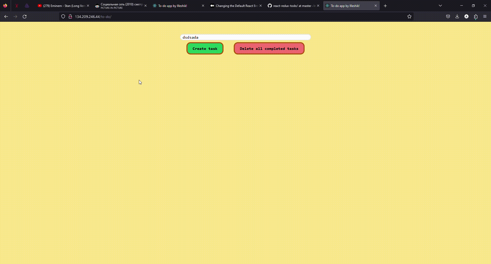

# Getting Started with my To-Do App

This project was created with Create React App, Redux Toolkit and Tailwind.

## If you wanna run this project on your own computer
1. Clone this repository on your own machine.
2. Go to downloaded folder.
3. Run <code>npm i</code> inside a folder.
4. Run <code>npm start</code>
5. Go to [localhost/to-do](localhost:3000/to-do) and use it with pleasure.

## Alternative (very easy) using
1. Go to [http://134.209.246.44/to-do/](http://134.209.246.44/to-do/) and use it with pleasure.
2. Rate this repository with a star, please.